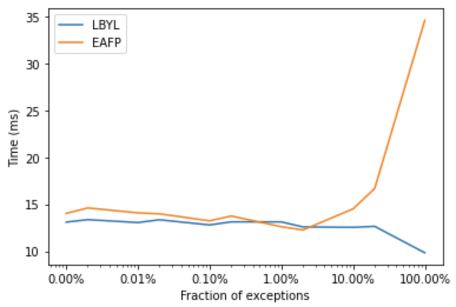

There are [two programming styles][stackoverflow]: [look before you leap (LBYL)][lbyl] and [easier to ask for
forgiveness than permission (EAFP)][eafp]. There are [pros and cons of both styles][comparison], EAFP in some
cases may be more readable and sometimes considered as [more idiomatic in Python][idiomatic-python] and other
modern languages. Both styles are best illustrated with an example. Say that we are implementing a function that
needs to divide two numbers, so it could fail due to `ZeroDivisionError`. Below, I marked with `+` the additional
steps will be taken when the exception would not appear, and with `-` the steps that are taken when it would
appear. To look before we leap, we would check if the number is non-zero and only then run the division.

```diff
+ if x != 0:
    return y/x
```

But instead, it might be easier to ask for forgiveness than permission: divide the numbers, but when doesn't work
due to `ZeroDivisionError` handle the exception.

```diff
try:
-     return y/x
- except ZeroDivisionError:
    pass
```

In the first case, there is a constant overhead due to checking the precondition. In the second case, there is
an overhead when the exception is raised, because in such a case, we do the general computation, raise an exception,
then check if we should catch and handle the exception. Let's try some benchmarks.


```python
def lbyl(x):
    if x != 0:
        return 1/x
    else:
        return 0

def eafp(x):
    try:
        return 1/x
    except ZeroDivisionError:
        return 0
```

When `x == 0` LBYL would always skip, while EAFP would always raise and catch the exception. In such a case,
EAFP is considerably slower.

```python
%%timeit -n 1000000
lbyl(0)
# 87.1 ns ± 6.41 ns per loop (mean ± std. dev. of 7 runs, 1000000 loops each)
```

```python
%%timeit -n 1000000
eafp(0)
# 313 ns ± 6.09 ns per loop (mean ± std. dev. of 7 runs, 1000000 loops each)
```

With `x != 0`, LBYL uses the default code path, while EAFP just does the computation, so it is faster because
it doesn't do any additional checks for preconditions.

```python
%%timeit -n 1000000
lbyl(1)
# 99.6 ns ± 4.83 ns per loop (mean ± std. dev. of 7 runs, 1000000 loops each)
```

```python
%%timeit -n 1000000
eafp(1)
# 88.4 ns ± 4.7 ns per loop (mean ± std. dev. of 7 runs, 1000000 loops each)
```

And now, let's try different degrees of error rates.

```python
from timeit import timeit

number_of_errors = [1, 5, 10, 50, 100, 500, 1_000, 5_000, 10_000, 50_000, 100_000]
avg_run_times = {}
steps = 1_000_000

def call(func, n):
    for i in range(steps):
        func(i % n)

for f in [lbyl, eafp]:
    times = []
    for n in number_of_errors:
        t = timeit(lambda: call(f, n), number=100)
        times.append(t)
    avg_run_times[f.__name__] = times
```

As we can see below, for code that always fails (100% error rate), there's a big overhead for EAFP. 
The overhead for EAFP drops with exceptions happening more rarely.



What does it show? There is an overhead for EAFP only when it needs to catch *a lot* of exceptions,
when they happen rarely (what *should* be the case), there is no overhead relatively to LBYL.


 [lbyl]: https://docs.python.org/3.9/glossary.html#term-lbyl
 [eafp]: https://docs.python.org/3.9/glossary.html#term-eafp
 [stackoverflow]: https://stackoverflow.com/questions/12265451/ask-forgiveness-not-permission-explain
 [idiomatic-python]: https://devblogs.microsoft.com/python/idiomatic-python-eafp-versus-lbyl/
 [comparison]: https://mathspp.com/blog/pydonts/eafp-and-lbyl-coding-styles
